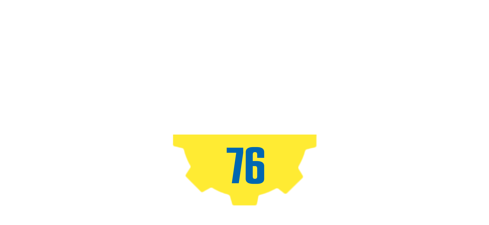

<!-- PROJECT LOGO -->
<br />


<h6 align="center">Pieter Venter Interactive Development 301</h6>
<p align="center">
</br>
   
  <a href="https://github.com/Pieter-stack/Fallout-tec">
    
  </a>
  
  <h3 align="center">Fallout-tec</h3>

  <p align="center">
   This website is designed for Fallout enthusiasts wanting to improve their gaming experience, with on the fly crafting recipes, having the ability to update the quantity of items in your inventory and see the stats of your items at 3 locations. S.P.E.C.I.A.L. perks are also ready for use. 
<br>
      <a href="https://github.com/Pieter-stack/Fallout-tec"><strong>Explore the docs »</strong></a>
      <br />
      <br />
      <a href="add video">View Demo</a>
       ·
       <a href="https://github.com/Pieter-stack/Fallout-tec/issues">Report Bug</a>
       ·
       <a href="https://github.com/Pieter-stack/Fallout-tec/issues">Request Feature</a>
   </p>

<!-- TABLE OF CONTENTS -->
## Table of Contents

* [About the Project](#about-the-project)
  * [Project Description](#project-description)
  * [Built with](#built-with)
* [Getting Started](#getting-started)
  * [Prerequisites](#prerequisites)
  * [Installation](#installation)
* [Features and Functionality](#features-and-functionality)
   * [Features](#features)
   * [Functionality](#functionality)
* [Concept Process](#concept-process)
   * [Ideation](#ideation)
   * [ERD](#erd)
   * [User-flow](#user-flow)
* [Development Process](#development-process)
   * [Implementation Process](#implementation-process)
        * [Highlights](#highlights)
        * [Challenges](#challenges)
   * [Reviews and Testing](#reviews-and-testing)
   * [Future Implementation](#future-implementation)
* [Final Outcome](#final-outcome)
   * [Mockups](#mockups)
   * [Promotional Video](#promotional-video)
* [Roadmap](#roadmap)
* [Contributing](#contributing)
* [License](#license)
* [Contact](#contact)
* [Acknowledgements](#acknowledgements)

<!--PROJECT DESCRIPTION-->
## About the Project

![image1][image1]

### Project Description
This website helps the gamers of Fallout to improve their gaming experience.

They can see the stock of all their items on the inventory page, update each item and have the ability to switch between locations while doing so.

The user can craft items within the 5 workstations and also on 3 diffrent locations.

On the location page the user can see how far they have travveled and see the locations on the map, they can also see an overview of their items at each location.

The registern page will send a mail with an authentication code to the user allowing the user to freely craft items.

On the perk page the user can seewhat level is required to unlock a perk and have fun exploring diferent perks.

### Built With

* [Visual Studio](https://visualstudio.microsoft.com/)
* [WAMP](https://www.wampserver.com/en/)
* [GitHub](https://github.com/)

&nbsp;&nbsp;&nbsp;&nbsp;&nbsp;&nbsp;&nbsp;&nbsp;
&nbsp;&nbsp;&nbsp;&nbsp;&nbsp;&nbsp;&nbsp;&nbsp;
&nbsp;&nbsp;&nbsp;&nbsp;&nbsp;&nbsp;&nbsp;&nbsp;

<!-- GETTING STARTED -->
## Getting Started

These instructions will get you a copy of the project up and running on your local machine for development and testing purposes.

### Prerequisites

For development, the latest version of Visual Studio is required. The latest version can be downloaded from [Visual Studio](https://visualstudio.microsoft.com/)
A version of Wamp/Mamp/Lamp will be needed to run this website
[WAMP](https://www.wampserver.com/en/)
[MAMP](https://www.mamp.info/en/mac/)
[LAMP](https://www.digitalocean.com/community/tutorials/how-to-install-linux-apache-mysql-php-lamp-stack-ubuntu-18-04)

### Installation
 
1. Clone the repo
```sh
git clone https://github.com/Pieter-stack/Fallout-tec.git
```
2. Start your Wamp/Mamp/Lamp server

3. Import the Sql file into phpMyAdmin 

4. Update the code to work with your server found in the Database.cs
 ```sh
private static string serverConfiguration = @"server=localhost;userid=USERID;password=PASSWORD;database=fallouttec;";
```

5. Start the server

<!-- FEATURES AND FUNCTIONALITY-->
## Features and Functionality

### Features

### Register page

![image2][image2]

Register with Fallout-Tec to receive your S.P.E.C.I.A.L authentication code.

### Home page

![image3][image3]

Store Anything
Build Anywhere
Craft to your hearts desire

### Inventory page

![image10][image10]

Store all your raw materials, craftable and extras, sort between the locations and search for any item within the inventory

### Crafting Page

![image6][image6]

Craft over 100 items , within 3 separate locations and 5 workstations to craft a wide variaty of items

### Location page

![image5][image5]

See how far you've travelled, specific pinpoints of all 3 your locations on the map, and see a overview of your items in your inventory at any location.

### Perks page

![image4][image4]

Explore and unlock perks to see a new wasteland full of unique abilities


### Artwork and designs created by me and found on Fallout wiki

The artwork was created with Figma.
[Fallout wiki](https://fallout.fandom.com/wiki/Fallout_Wiki)

### Functionality

* `MVC`  the model view controller is used to connect the functionality and display it on the frontend.
* `Craft items` deduct items from inventory when an item is crafted.
* `Local Storage` is implemented to save location and stations on the page.
* `Database` where all the stock is stored .
* `Register page` Mailing implemented to mail the user an authentication code.

<!-- CONCEPT PROCESS -->
## Concept Process

The `Conceptual Process` is the set of actions, activities and research that was done when starting this project.

### Ideation

![image7][image7]

### ERD

![image8][image8]

### User-flow

![image9][image9]

<!-- DEVELOPMENT PROCESS -->
## Development Process

The `Development Process` is the technical implementations and functionality done in the backend of the application.

### Implementation Process

#### Design Architecture
`MVC` Model view controller to link backend functionality to the frontend.

#### Highlights
I liked this project being we could have chosen the theme for our inventory website, so I chose one of my favorite games.

#### Challenges

I struggled with some functionality due to how much items I have in my database and how it was structured but at the end I made an amazing project with a lot of items.

#### Future Implementation
 I still want to add a user Login and a market page for the user to buy/sell materials.

<!-- MOCKUPS -->
## Final Outcome

### Mockups

![image11][image11]

<!-- PROMO VIDEO -->
## Promotional Video

To see the promotional video, click below:

[View Promotional Video](https://youtu.be/bE_zQGm_tHk)

<!-- ROADMAP -->
## Roadmap

See the [open issues](https://github.com/Pieter-stack/Fallout-tec/issues) for a list of proposed features (and known issues).

<!-- CONTRIBUTING -->
## Contributing

Contributions are what make the open source community such an amazing place to be learn, inspire, and create. Any contributions you make are **greatly appreciated**.

1. Fork the Project
2. Create your Feature Branch (`git checkout -b feature/AmazingFeature`)
3. Commit your Changes (`git commit -m 'Add some AmazingFeature'`)
4. Push to the Branch (`git push origin feature/AmazingFeature`)
5. Open a Pull Request

<!-- AUTHORS -->
## Authors

* **Pieter Venter** - [PieterVenter](https://github.com/Pieter-stack)

<!-- LICENSE -->
## License

Distributed under the MIT License. See `LICENSE` for more information.\

<!-- LICENSE -->
## Contact

* **Pieter Venter**  - pieterven12@gmail.com
* **Project Link** - https://github.com/Pieter-stack/Fallout-tec

<!-- ACKNOWLEDGEMENTS -->
## Acknowledgements

* [Fallout wiki](https://fallout.fandom.com/wiki/Fallout_Wiki)
* [Mockups](https://www.freepik.com)
* [Lecturer](https://github.com/ArmandPret)


<!-- MARKDOWN LINKS & IMAGES -->
[image1]: Images/Image1.png
[image2]: Images/Image2.png
[image3]: Images/Image3.png
[image4]: Images/Image4.png
[image5]: Images/Image5.png
[image6]: Images/Image6.png
[image7]: Images/Image7.png
[image8]: Images/Image8.png
[image9]: Images/Image9.png
[image10]: Images/Image10.png
[image11]: Images/Mockup6.png

 
